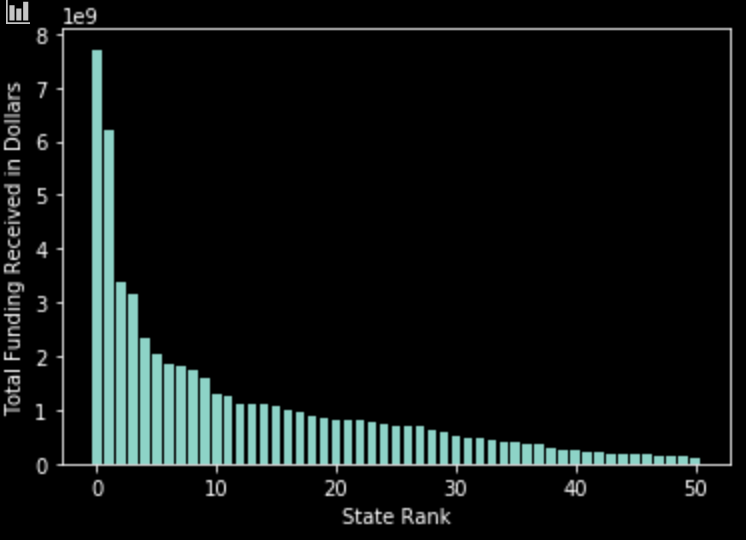
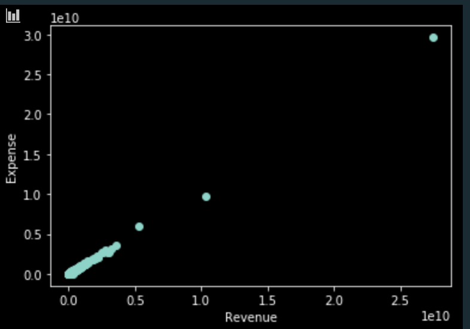
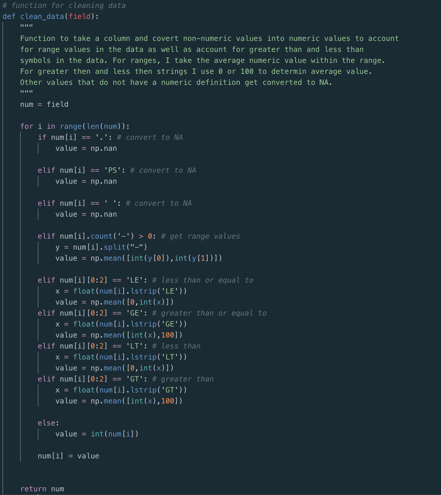
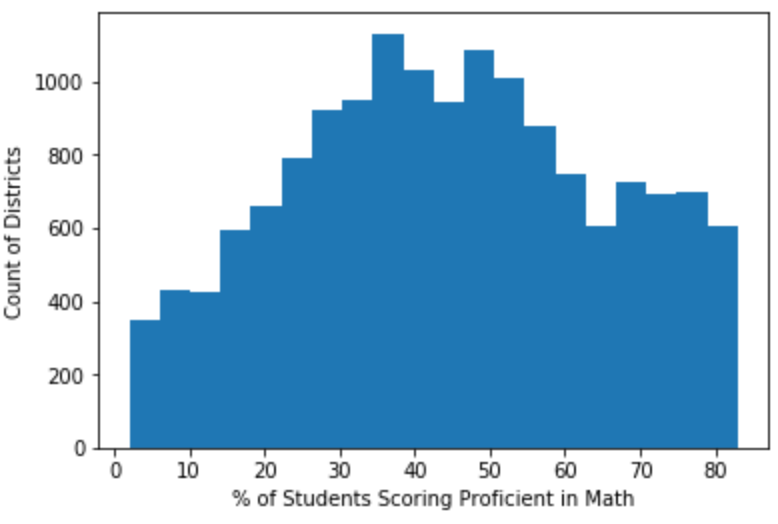
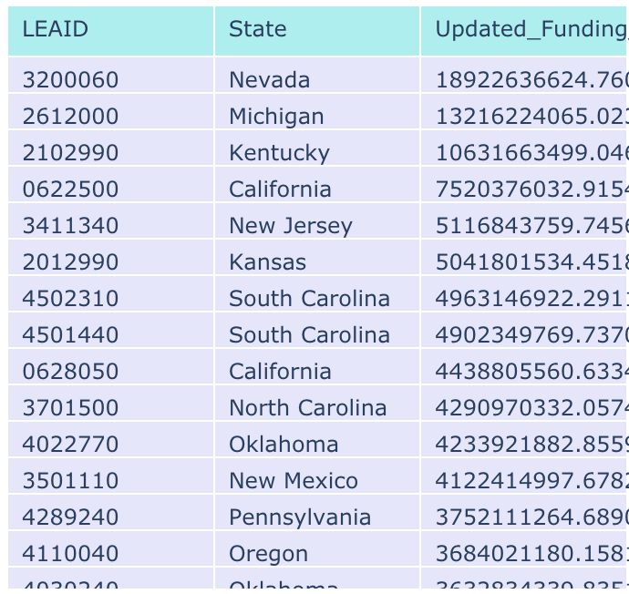

# Homework 3

## Question 1

The chart below displays the states that receive the most federal funding ordered by the total federal funding received.

DC, New York, and Vermont spend the most per student when looking at the total amount of federal spending compared to the number of students in the state.

## Question 2

As expected and shown below, their is a linear relationship between a districts total revenue and total expenses. In order to balance the budget and not take on too much debt,the dollar value for each should be the same.

Hawaii, Indiana, and Connecticut have the greatest amount of deb per student. In order to arrive at debt to student ratio, I difference in total revenue and expense by state and divided by the number of students in the state.

## Question 3

THe function I created takes a column and converts non-numeric values into numeric values to account for range values in the data as well as account for greater than and less than symbols in the data. For ranges, I take the average numeric value within the range of the maximum and minimum range values. For greater then and less then strings, I strip the text representing the operation and I use 0 or 100 to determine average value - 0 for less than operators and 100 for greater than. Other values that do not have a numeric definition get converted to NA (i.e. 'PS')

I leveraged the function above to clean math results data by district to look at the distiribution of students who achieved strong results on standardized math testing.

## Question 4

The total US Federal Budget is *$55,602,739,138*.
In order to reduce the budget by 15%, the US would need to reduce the budget by *$8,340,410,870*.

The updated funding per state is below. I leveraged national math proficiency scores to identify specific districts that would be getting budget cuts. 

## Question 5

I leveraged a performance based model to identify districts to cut funding to. Basically, I went with this assumption that schools that were high performing did not need as high of a level of funding at the funding fron those schools could be redistributed to schools that are worse performing. To do this, I identified the national average for percent of students who scored proficient in math exams and then identified districts where the percent of proficient math scores is at least one stardard deviation above the national average. These were the schools that end up with reduced funding. 

Their are some flaws with this way of approaching the problem. As I thought more about it, I did not think this was an appropriate way of managing reduction in funding as it would not be considering a lot of important information that I think is needed to make this type of decision. The first thing I would like to know is how much funding is coming from the state. This data is describing the funding coming the federal government but an important factor would be how much state funding a disctrict is getting as this would impact the redistrubtion. A few other things that would impact the way in which I would redistribute funds would be things like the number of schools as well as types of schools in a district - are thier charter schools in the district or do many students go to private schools? I would also look at student to teacher ratios as well as the physical state of the school systems whithin a district - are their certain districts that need more capital for construction and repairs/improvemnts than other districts. Without having a lof of this information, it seems like the most fair way is to reduce each district by the same amount.

